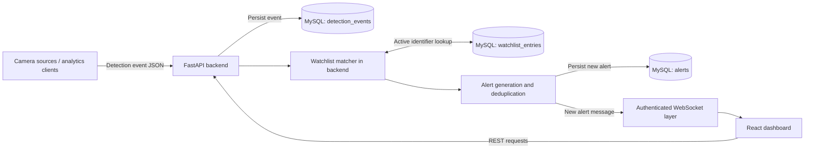

# okDriver CCTV Monitoring & AI Event Management Platform

An operations prototype for camera registry, detection-event intake, watchlist matching, alert handling, and map-based vehicle trace. The React interface uses a FastAPI API backed by MySQL. Detection results can be submitted to the API, evaluated against the watchlist, and delivered to connected users over WebSocket.

> **Prototype scope:** The repository includes simulated MP4 camera feeds and a detection-event API. It does not include a camera-stream ingest service or an AI inference model.

## Project Overview

The platform provides a shared operational view of registered cameras and events. Operators can inspect camera status, review event and alert history, acknowledge or resolve alerts, manage watchlist records according to their role, and trace an identifier through camera sightings.

The event pipeline begins when an upstream analytics system or simulator submits a detection payload. The backend validates and stores the event, checks active watchlist entries, suppresses recent duplicate alerts for the same camera and watchlist entry, and broadcasts newly created alerts to authenticated WebSocket clients.

## Key Features

- **Camera registry:** Create, update, list, and disable cameras; filter by department, status, zone, and search text; view per-camera audit history.
- **Dashboard:** Camera status counts, active alert and watchlist counts, and recent events and alerts.
- **Detection events:** Validated event ingestion and a recent event-history endpoint.
- **Watchlist management:** Create, update, search, list, and deactivate vehicle or person identifiers.
- **Alert management:** Automatic alerts from matching detections, plus acknowledge and resolve actions.
- **Vehicle trace:** Chronological sightings plotted at the locations of the corresponding cameras.
- **Authentication and authorization:** JWT login, password hashing, and Admin / Operator route permissions.
- **Rate limiting:** In-memory limits of 5 login requests/minute/IP and 60 detection submissions/minute/IP.
- **Audit logs:** Existing camera audit records plus generic audit records for watchlist and alert mutations.
- **Real-time updates:** Authenticated WebSocket broadcasts for new alerts.
- **Simulated feeds:** Two local MP4 files displayed in the Live Feeds page.

## System Architecture



The matcher and alert logic run inside the FastAPI backend; they are not separate services. Camera protocol and stream endpoint fields are registry metadata. Actual RTSP/ONVIF stream ingestion is not implemented.

## Database Design

SQLAlchemy models are registered when the backend imports `app.models`. The application calls `Base.metadata.create_all()` at startup, which creates missing tables but is not a versioned migration system.

| Table | Main data | Purpose and relationships |
|---|---|---|
| `users` | Username, password hash, role, active flag, creation time | Login identities. Username is unique. Roles are `admin` and `operator`. |
| `cameras` | Camera ID, name, department, latitude/longitude, protocol, stream endpoint, status, heartbeat, zone, disabled flag, timestamps | Camera registry. `camera_id` is unique. Other tables store camera IDs as values rather than foreign keys. |
| `camera_audit_logs` | Camera ID, action, optional detail, timestamp | Existing camera create/update/disable history. Read through the camera-specific audit route. |
| `detection_events` | Camera ID, event type, identifier, optional vehicle type/bounding box, confidence, event and creation timestamps | Persisted detection history. The project calls these “events”; the physical table is named `detection_events`. |
| `watchlist_entries` | Entity type, identifier, category, optional description, severity, active flag, timestamps | Active or deactivated vehicle/person watchlist entries. |
| `alerts` | Camera ID, watchlist entry ID, matched identifier, confidence, status, detected/acknowledged/resolved timestamps, acknowledging name | Alert records. `watchlist_entry_id` references `watchlist_entries.id`. |
| `audit_logs` | Entity type, string entity ID, action, optional detail, UTC creation timestamp | Generic records for watchlist create/update/deactivate and alert acknowledge/resolve actions. It does not reference users or expose a general audit query API. |

## API Overview

Interactive OpenAPI documentation is available at `http://localhost:8000/docs` while the backend is running. All application routes except login and health require a bearer token. Admin-only writes are marked below.

| Method | Endpoint | Purpose | Access |
|---|---|---|---|
| `GET` | `/health` | Backend health response | Public |
| `POST` | `/api/auth/login` | Exchange URL-encoded `username` and `password` for a JWT and user role | Public; 5/min/IP |
| `GET` | `/api/cameras/` | List/filter cameras | Admin, Operator |
| `POST` | `/api/cameras/` | Register a camera | Admin |
| `GET` | `/api/cameras/{camera_id}` | Read camera details | Admin, Operator |
| `PUT` | `/api/cameras/{camera_id}` | Update camera details | Admin |
| `PATCH` | `/api/cameras/{camera_id}/disable` | Disable a camera | Admin |
| `GET` | `/api/cameras/{camera_id}/audit` | Read camera audit history | Admin, Operator |
| `GET` | `/api/dashboard/summary` | Dashboard statistics and recent records | Admin, Operator |
| `POST` | `/api/events/detection` | Validate/store a detection and evaluate watchlist | Admin, Operator; 60/min/IP |
| `GET` | `/api/events/detection` | List up to 100 recent detections; optional camera/event type filters | Admin, Operator |
| `GET` | `/api/watchlist/` | List/search/filter watchlist records | Admin, Operator |
| `POST` | `/api/watchlist/` | Create a watchlist entry | Admin |
| `PUT` | `/api/watchlist/{entry_id}` | Update a watchlist entry | Admin |
| `DELETE` | `/api/watchlist/{entry_id}` | Deactivate a watchlist entry | Admin |
| `GET` | `/api/alerts/` | List alerts; optional status/camera filters | Admin, Operator |
| `PATCH` | `/api/alerts/{alert_id}/acknowledge` | Acknowledge an alert | Admin, Operator |
| `PATCH` | `/api/alerts/{alert_id}/resolve` | Resolve an alert | Admin, Operator |
| `GET` | `/api/trace/{identifier}` | Return chronological camera sightings for an identifier | Admin, Operator |
| `WS` | `/ws/alerts` | Receive new-alert broadcasts | Admin, Operator |

Successful login returns an `access_token`, `token_type`, and user identity/role. The frontend keeps that session in memory; a browser refresh returns the user to login.

## Security Architecture

- **JWT authentication:** Login accepts URL-encoded form fields. The backend signs HS256 access tokens with the configured secret and a 30-minute lifetime. Verification fixes the accepted algorithm, requires an `exp` claim, and checks the active user in MySQL.
- **Password hashing:** Passwords are hashed with Argon2 through `pwdlib`; only the hash is stored in `users`.
- **Protected routes:** FastAPI dependencies enforce authenticated access. Admins can manage cameras and watchlists; Operators can use operational reads, detection ingestion, and alert actions. `/health` and login remain public.
- **WebSocket authentication:** The client sends its raw JWT as the first text frame. The backend validates it and the user role before registering the connection for broadcasts. Missing/invalid credentials, expired tokens, inactive users, and unsupported roles are rejected; the initial message has a five-second timeout.
- **Rate limiting:** Login and detection intake use per-process, in-memory rolling windows keyed by the direct client IP. Limits return HTTP 429 with `{"detail":"Rate limit exceeded"}`. They are not shared between workers or instances.
- **Audit logging:** Camera history is stored separately from generic watchlist/alert mutation records. Generic audit rows currently do not include an actor user ID and have no general read endpoint.
- **Environment secrets:** `JWT_SECRET` must be configured and at least 32 characters. Do not commit a real `.env` file or production secret.

## Real-Time Architecture

When a detection matches an active watchlist entry and is not suppressed as a duplicate, the backend stores an alert and sends a `new_alert` JSON message through the in-process connection manager. Dashboard and Alerts pages listen for messages and reload their REST data.

WebSocket connections are held in memory by one backend process. There is no Socket.IO, SSE, Redis pub/sub, or broker-based fan-out. Rate limiting is also process-local.

## Project Structure

```text
.
├── README.md
├── docker-compose.yml
├── backend/
│   ├── app/
│   │   ├── core/          # Settings, database, auth, rate limiting, WebSocket manager
│   │   ├── models/        # SQLAlchemy tables
│   │   ├── routers/       # FastAPI endpoints
│   │   ├── schemas/       # Pydantic request/response validation
│   │   └── services/      # Watchlist matcher and alert deduplication
│   ├── certs/             # MySQL CA certificate
│   ├── create_user.py     # Admin/Operator provisioning CLI
│   ├── seed_cameras.py
│   ├── seed_watchlist.py
│   ├── simulate_events.py
│   ├── requirements.txt
│   └── Dockerfile
└── frontend/
    ├── public/videos/     # Simulated camera MP4 files
    ├── src/
    │   ├── api/           # Shared Axios client
    │   ├── components/    # Camera form and camera map
    │   └── pages/         # Dashboard, cameras, feeds, alerts, events, trace, watchlist, login
    ├── package.json
    ├── vite.config.js
    └── Dockerfile
```

## Setup Instructions

### Prerequisites

- Python 3.11+
- Node.js 20+ and npm
- A reachable MySQL instance and its CA certificate

### Database Setup

Create a database and user in MySQL, and grant that user access to the database. For example:

```sql
CREATE DATABASE okdriver_cctv CHARACTER SET utf8mb4;
CREATE USER 'okdriver'@'%' IDENTIFIED BY 'replace-with-a-strong-password';
GRANT ALL PRIVILEGES ON okdriver_cctv.* TO 'okdriver'@'%';
```

The backend uses the configured CA file for its MySQL TLS connection. Ensure the path in `DB_SSL_CA` points to the appropriate certificate. The repository default is `certs/ca.pem` relative to the backend working directory.

### Backend Setup

```powershell
cd backend
python -m venv venv
.\venv\Scripts\Activate.ps1
python -m pip install -r requirements.txt
Copy-Item .env.example .env
```

Edit `backend/.env` with database credentials and a generated JWT secret. Generate a secret with:

```powershell
python -c "import secrets; print(secrets.token_urlsafe(32))"
```

Environment variables:

| Variable | Purpose |
|---|---|
| `DB_HOST` | MySQL host |
| `DB_PORT` | MySQL port, normally `3306` |
| `DB_USER` | MySQL user |
| `DB_PASSWORD` | MySQL password |
| `DB_NAME` | MySQL database name |
| `DB_SSL_CA` | MySQL CA certificate path |
| `JWT_SECRET` | Required signing secret, minimum 32 characters |
| `JWT_ALGORITHM` | Fixed to `HS256` |
| `JWT_ACCESS_TOKEN_MINUTES` | Access-token lifetime; default `30` |

The application creates missing mapped tables at startup. Create an initial account from the backend directory:

```powershell
python create_user.py <username> admin
```

The CLI prompts for a password and confirmation. Use `operator` instead of `admin` to create an Operator.

### Frontend Setup

```powershell
cd frontend
npm install
```

The frontend API client currently uses `http://localhost:8000`; the backend CORS configuration allows `http://localhost:5173`.

## Running the Project

Start the backend in one terminal:

```powershell
cd backend
.\venv\Scripts\Activate.ps1
python -m uvicorn app.main:app --reload --host 0.0.0.0 --port 8000
```

Start the frontend in another terminal:

```powershell
cd frontend
npm run dev
```

Open `http://localhost:5173`. The API is at `http://localhost:8000`, with interactive documentation at `http://localhost:8000/docs`.

`docker-compose.yml` defines frontend and backend containers, but does not define a MySQL service; configure an external/reachable MySQL server through `backend/.env` before using Compose.

## Testing

There is no automated backend test suite configured in the repository. Available frontend checks are:

```powershell
cd frontend
npm run lint
npm run build
```

For a backend smoke check, start the API and request:

```powershell
curl.exe http://localhost:8000/health
```

Use `/docs` to exercise authenticated routes. Login uses `application/x-www-form-urlencoded` fields (`username`, `password`); pass the returned access token as `Authorization: Bearer <token>` for protected HTTP endpoints.

## Scalability Considerations

- **Horizontal scaling:** The current WebSocket connection list and rate limiter are process-local. Multiple backend instances would not share broadcasts or counters. A future multi-instance deployment could use a shared pub/sub layer for alert fan-out and shared rate-limit storage; neither is part of the current implementation.
- **Event throughput:** Detection handling is synchronous with database writes and watchlist lookup. At higher volumes, measure latency and database load before introducing an event broker. Kafka could be evaluated as a future event-stream option if measured throughput justifies it; it is not currently used.
- **Database optimization:** Add pagination for growing list endpoints, review query plans/indexes, and avoid repeated camera lookups in trace processing if data volume warrants it. Schema changes currently use `create_all()` rather than migrations.
- **Monitoring:** `/health` is a basic status endpoint. Metrics, structured operational logging, alerting, and deployment health checks are not configured in this repository.

## Known Limitations

- This is a prototype implementation, not a production camera-management or AI inference system.
- Live Feeds plays two local sample MP4s; RTSP/ONVIF ingestion and transcoding are not implemented.
- Detection events must be submitted by an upstream client or simulator; no AI model is included.
- WebSocket broadcasts and rate limits are single-process/in-memory and reset with process restarts.
- Docker Compose runs the app services but does not provision MySQL.
- Generic audit logs are persisted but do not have a dedicated read API or UI.
- The frontend keeps authentication state in memory, so refreshing the browser requires signing in again.

## Future Improvements

- Integrate a real camera/media gateway and an external analytics producer.
- Add database migrations and pagination for event, alert, and audit history.
- Add a supported multi-instance WebSocket fan-out and shared rate-limit store if horizontal deployment is required.
- Add automated backend API tests and frontend workflow tests.
- Add production deployment configuration, operational metrics, and health monitoring.
- Add a controlled audit-log review interface if required by the product workflow.

## Demo Workflow

1. Configure MySQL and backend environment variables, then start the backend and frontend.
2. Create an Admin account with `python create_user.py <username> admin` and sign in at `http://localhost:5173`.
3. Seed the example cameras and watchlist from the backend directory:

   ```powershell
   python seed_cameras.py
   python seed_watchlist.py
   ```

4. Review camera status and locations in Camera Registry and Dashboard; inspect the simulated MP4 files under Live Feeds.
5. Submit a detection for seeded watchlist identifier `GJ01XX0001` to create and broadcast an alert. Example PowerShell request:

   ```powershell
   $form = @{ username = '<username>'; password = '<password>' }
   $login = Invoke-RestMethod -Method Post -Uri 'http://localhost:8000/api/auth/login' -ContentType 'application/x-www-form-urlencoded' -Body $form
   $headers = @{ Authorization = "Bearer $($login.access_token)" }
   $event = @{
     camera_id = 'C001'
     event_type = 'anpr'
     identifier = 'GJ01XX0001'
     vehicle_type = 'car'
     confidence = 0.95
     timestamp = [DateTime]::UtcNow.ToString('o')
   } | ConvertTo-Json
   Invoke-RestMethod -Method Post -Uri 'http://localhost:8000/api/events/detection' -Headers $headers -ContentType 'application/json' -Body $event
   ```

6. Acknowledge or resolve the resulting alert, and search its identifier in Vehicle Trace after additional detections have been submitted.

## Screenshots

Add screenshots to `docs/screenshots/` and update the placeholders below when available.

### Dashboard

_Screenshot placeholder._

### Camera Registry

_Screenshot placeholder._

### Watchlist

_Screenshot placeholder._

### Alerts

_Screenshot placeholder._

### Map View

_Screenshot placeholder._

### Login Screen

_Screenshot placeholder._